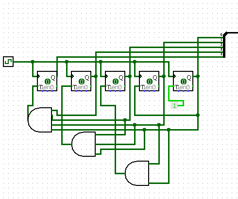
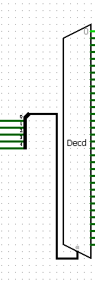
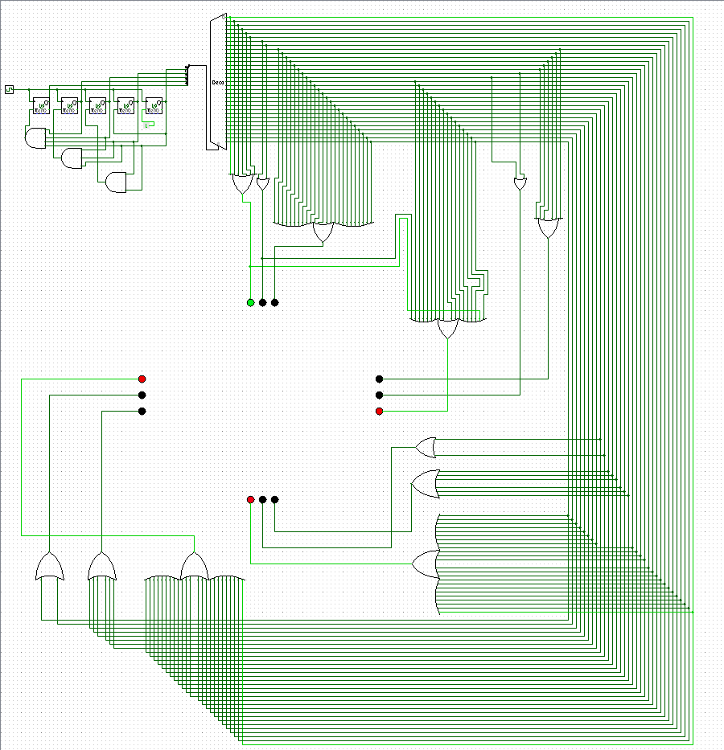
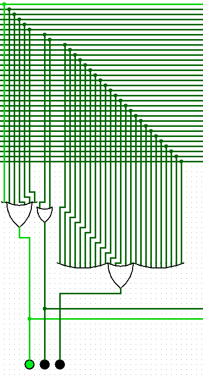
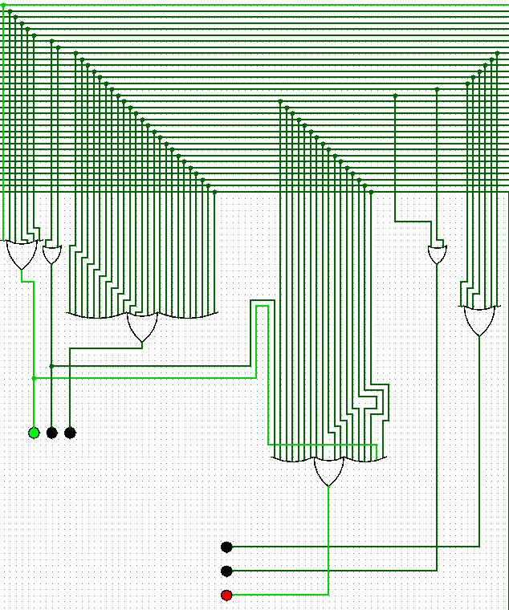
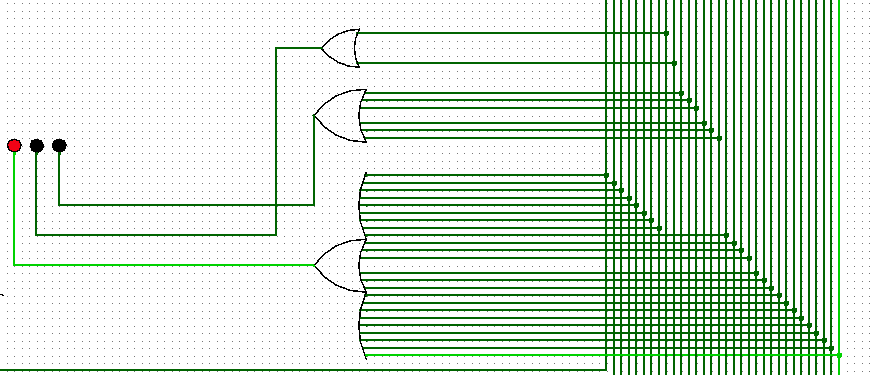
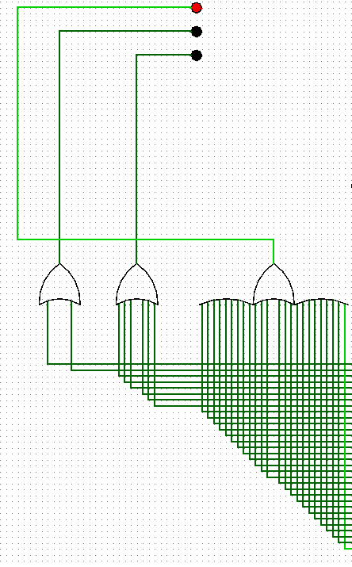

# 🚦 Traffic Light Simulator using T Flip-Flops & Decoder

**Author:** Krish Mojidra  
**Pursuing:** B.Tech in Computer Science and Engineering    
**Software Used:** Logisim  

---

## 🧠 Overview
This project simulates a four-way traffic light controller using **T Flip-Flops** and a **5-to-32 line decoder**.  
A 5-bit counter cycles through 32 states, and logic gates combine decoder outputs to control **Red**, **Yellow**, and **Green** LEDs for each road direction.

---

## ⚙️ Working Principle
1. A 5-bit T Flip-Flop counter generates binary states (0–31).  
2. The decoder activates one unique output line at a time.  
3. Logic gates interpret these lines to control the lights as follows:
   - States 0–7 → North = Green  
   - States 8–9 → North = Yellow  
   - States 10–17 → East = Green  
   - States 18–19 → East = Yellow  
   - States 20–27 → South = Green  
   - States 28–29 → South = Yellow  
   - States 30–31 → West = Green  

---

## 📸 Circuit Snapshots
| Circuit | Image |
|----------|--------|
| Counter |  |
| Decoder |  |
| Entire System |  |
| Logic (North) |  |
| Logic (East) |  |
| Logic (South) |  |
| Logic (West) |  |

---

## 🎬 Demo Video
Watch the working simulation of the traffic light system:

[▶️ Click to View Demo](Project_Demo/traffic_light_demo.mp4)

---

## 🧩 Features
- Fully automatic traffic control simulation  
- Uses sequential (flip-flops) and combinational logic (decoder + gates)  
- Realistic light phase cycle for four directions  

---

## 🛠️ Future Scope
- Add reset button for manual control  
- Extend design to 8-way intersection  
- Implement on FPGA or Arduino  

---

## 🧾 License
MIT License © 2025 Krish Mojidra
